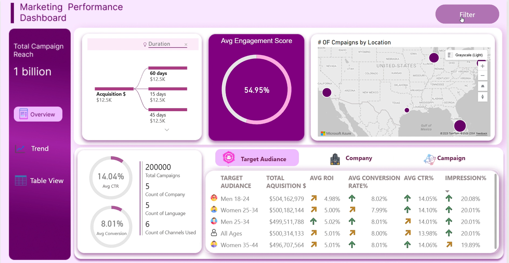
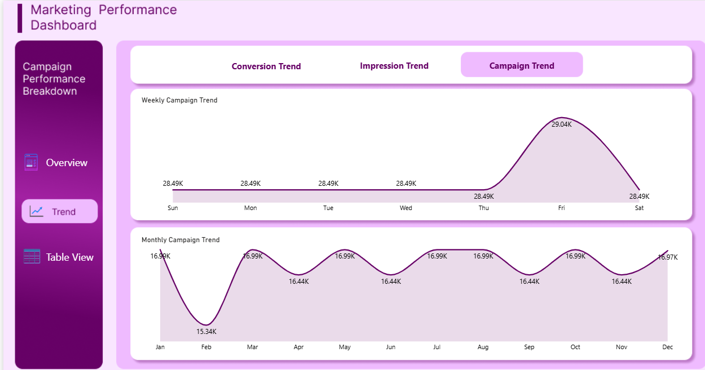

<h1 align="center"> Marketing Performance Dashboard</h1>

This Power BI dashboard provides a comprehensive overview of marketing performance, helping uncover campaign trends, engagement patterns, and audience behavior. It turns raw data into meaningful business insights that can guide better marketing strategies, optimize campaign timing, and improve overall ROI.  
The report is fully interactive and designed for professional use, offering smooth filtering, visual consistency, and detailed breakdowns of campaign outcomes.  

# Overview Page Summary

The overview page of the Marketing Performance Dashboard offers a concise view of campaign scale, engagement, and reach. With a total campaign reach of **1 billion**, it demonstrates strong visibility and market penetration across key U.S. regions, including **California, Florida, and Texas**. The **average engagement score of 54.95%** highlights active audience interaction, supported by a **click-through rate of 14.04%** and a **conversion rate of 8.01%**, reflecting both effective targeting and compelling campaign content.

There are **200,000 campaigns** running across **five companies**, **five languages**, and **six channels**, underscoring the depth and diversity of operations. Acquisition spending remains consistent at **$12.5K** across all time durations, indicating disciplined financial management.

**Key audience insights include:**
- Men aged 25–34 achieving the highest ROI at **5.02%**, showing strong profitability within this demographic.  
- Women aged 25–34 recording the highest CTR at **14.10%**, indicating strong engagement and message resonance.  

Overall, this page highlights a well-balanced marketing strategy that effectively combines scale, audience engagement, and financial efficiency.

# Trend Page Summary

The trend page of the Marketing Performance Dashboard provides a dynamic view of campaign activity patterns across both weekly and monthly timeframes. The **weekly campaign trend** displays consistent engagement throughout most of the week, holding steady at **28.49K** from Sunday to Thursday, peaking sharply on **Friday at 29.04K**, and returning to 28.49K on Saturday. This indicates that audience interactions intensify toward the end of the workweek, likely driven by increased online activity or strategic end-week campaign execution.

The **monthly campaign trend** shows a stable performance rhythm across the year, with occasional dips and rebounds. Campaign activity starts at **16.90K in January**, drops to **15.34K in February**, then rises to **16.99K in March** and maintains a consistent level throughout the rest of the year. Months like **May, July, August, and October** remain steady at around **16.99K**, reflecting continuous campaign momentum and sustained engagement.

Overall, the trend page highlights a **steady and predictable campaign flow**, with clear peak performance on Fridays and consistent engagement across most months. These insights can guide better scheduling, ensuring marketing efforts are maximized during periods of strongest audience response.

## Table View Page Summary  

The Table View page consolidates all major campaign performance indicators such as total leads, conversions, impressions, and engagement into a clear, data-driven format. It mirrors the findings from the Overview and Trend pages, presenting them in a structured layout that allows for quick comparison across different campaigns. This unified table view supports identifying top-performing campaigns and areas that require optimization, ensuring strategic decision-making based on complete visibility.  

### **Filter Pane**

The Filter Pane in this dashboard is designed to provide interactive control over the dataset, enabling focused performance analysis across multiple dimensions. It allows filtering based on **company**, **target audience**, **language**, and **marketing channels**, making it easier to evaluate how each vertical contributes to overall campaign success.  

By applying these filters, users can seamlessly compare results across audience segments, identify top-performing channels, and analyze how campaign effectiveness varies across companies and languages. This feature enhances strategic decision-making by providing a clear view of what drives the strongest engagement in each category.  

# Delivery & Collaboration

This dashboard has been developed with a focus on actionable insights, scalability, and seamless integration into existing marketing workflows. It empowers stakeholders across teams to make data-driven decisions with confidence.

The iterative development process includes continuous feedback loops from marketing, analytics, and product teams to ensure the dashboard evolves with business needs.

For further enhancements or custom requests, please engage with the analytics team through the established collaboration channels. Together, we drive informed marketing strategies that deliver measurable impact.

🔗 **View the Dashboard Report:**  
[Marketing Performance Dashboard (.pbix)](https://github.com/AreeshaSolangi/Projects/blob/main/Power%20BI/Marketing%20Performance%20Dashboard/Marketing%20Performance%20Dashboard.pbix)
