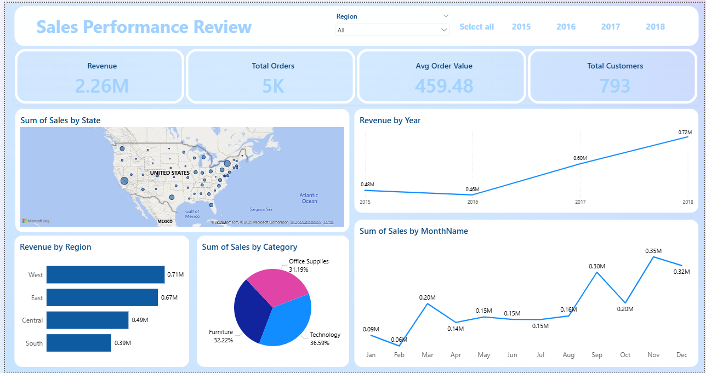
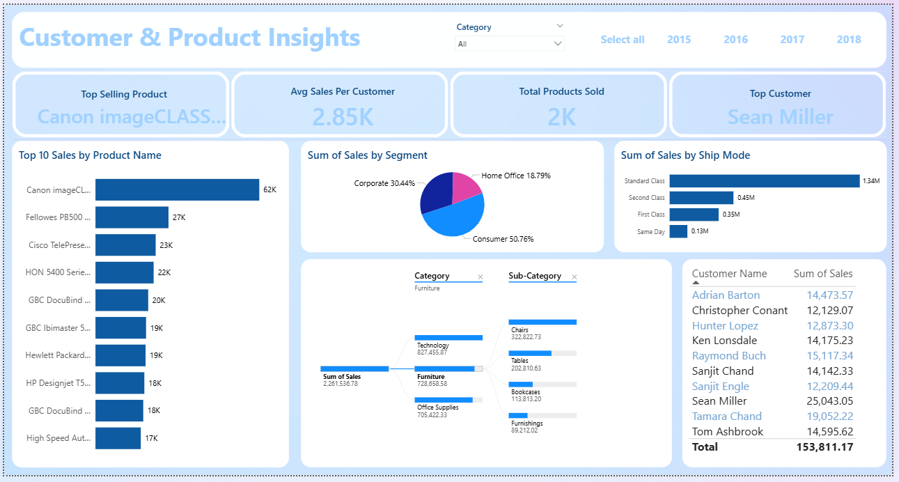

# 🛍️ Superstore Sales Dashboard – Power BI  

## 📌 Introduction  
This project presents an interactive **Power BI dashboard** built on the Superstore dataset. The goal was to analyze sales performance, identify patterns, and highlight actionable insights for decision-making. The dashboard covers key metrics such as revenue, customer segmentation, shipping modes, product performance, and regional trends.  

## 📂 Dataset  
The dataset was sourced from Kaggle:  
🔗 [Sales Forecasting Dataset on Kaggle](https://www.kaggle.com/datasets/rohitsahoo/sales-forecasting)  

## 📑 Power BI Report  
You can access the complete Power BI file here:  
🔗 [Superstore Sales Dashboard Report (.pbix)](https://github.com/AreeshaSolangi/Projects/blob/main/Power%20BI/Super%20Store%20Dashboard%20Report/Retail%20Store%20Sales.pbix)  

## 📊 Dashboard Pages  

### 📄 Page 1 – Sales Performance Review  
  

### 📄 Page 2 – Customer & Product Insights  
  

## 🔎 Key Insights  
- Sales grew steadily from 2016 to 2018, reaching the highest at **0.72M in 2018**, confirming strong upward momentum.  
- The **Consumer segment** contributes **50.76%** of total revenue, making it the key focus area for growth.  
- **Standard Class shipping** accounts for **56.44%** of sales, showing efficiency but also reliance on one mode.  
- The **West region** generates **0.71M** in revenue, while the **South** lags at **0.39M**, highlighting regional imbalance.  
- **Canon imageCLASS** contributes **40.5%** of top product sales, signaling heavy dependency on one product.  
## 🚀 Final Note  
This dashboard not only highlights where the business is performing well but also pinpoints areas that need attention. The insights can help decision-makers reduce dependency on a single product, explore opportunities in weaker regions, and strengthen strategies around the Consumer segment for sustainable growth.  

