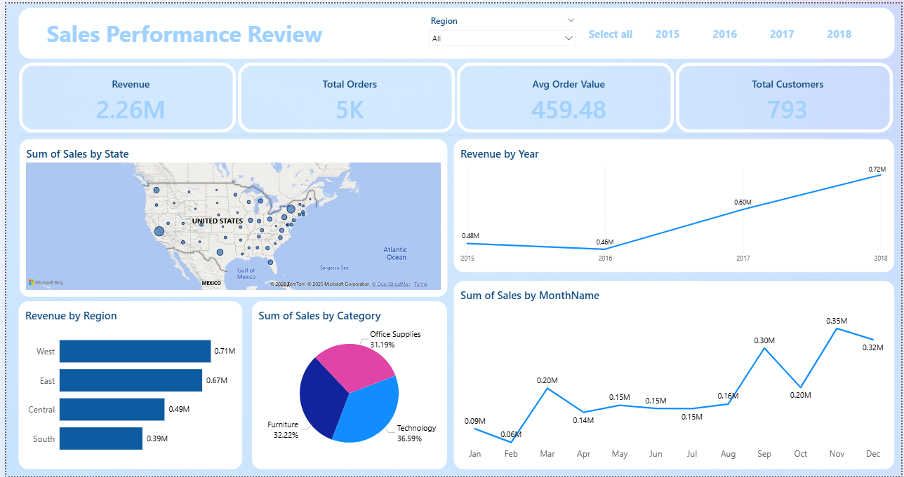
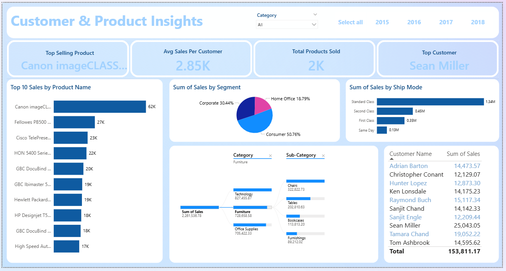

<h1 align="center">🛍️ Superstore Sales Dashboard</h1>

This Power BI dashboard provides a comprehensive overview of Superstore’s sales performance, enabling a deeper understanding of how different factors influence business growth. It transforms raw transactional data into clear and actionable insights, helping business leaders identify profitable segments, optimize product strategy, and enhance overall sales efficiency.  

The report is fully interactive and built for professional analysis, offering smooth navigation, consistent visuals, and detailed metric breakdowns across multiple dimensions including region, category, shipping mode, and customer segment.  

---

## 📊 Sales Performance Review  

The Sales Performance Review page highlights key business indicators such as yearly revenue growth, segment contribution, and shipping mode distribution. The visual layout is designed to help decision-makers quickly assess overall performance and identify emerging trends across years and regions.  

**Key highlights include:**  
- Sales showed steady growth from 2016 to 2018, peaking at **$0.72M in 2018**, indicating consistent upward momentum.  
- The **Consumer segment** generated **50.76%** of total revenue, reflecting strong customer engagement and market reach.  
- **Standard Class shipping** accounted for **56.44%** of all orders, showing reliability but also dependency on one mode.  
- The **West region** led with **$0.71M in revenue**, while the **South** lagged at **$0.39M**, suggesting potential expansion opportunities.  

Overall, this page provides a clear snapshot of sales progress and performance efficiency across multiple business dimensions.  

---

## 💡 Sales Performance Insights  

The Sales Performance Insights page dives deeper into customer behavior, product trends, and profitability patterns. It focuses on uncovering the factors that drive top performance and identifying areas where improvements can be made.  

**Key insights include:**  
- The **Canon imageCLASS** product line alone contributes **40.5%** of top sales, signaling a heavy reliance on one key item.  
- The **Technology** category shows higher profitability compared to others, supported by consistent demand and pricing power.  
- Regional and segment-level breakdowns reveal imbalances in growth, emphasizing the need to diversify sales strategies.  

This page supports strategic planning by showcasing actionable insights that can improve product focus, balance regional sales, and boost overall profitability.  

---

## 📂 Dataset Source  

The dataset used for this analysis was obtained from Kaggle:  
🔗 [Sales Forecasting Dataset on Kaggle](https://www.kaggle.com/datasets/rohitsahoo/sales-forecasting)  

---

## 📑 Power BI Report  

You can access the complete Power BI report here:  
🔗 [Superstore Sales Dashboard (.pbix)](https://github.com/AreeshaSolangi/Projects/blob/main/Power%20BI/Super%20Store%20Dashboard%20Report/Retail%20Store%20Sales.pbix)  

---

## 🚀 Conclusion  

This dashboard delivers a powerful visualization of Superstore’s business performance. By uncovering trends in revenue growth, customer segments, and product performance, it equips decision-makers with data-driven insights for smarter business strategies. The findings highlight opportunities to reduce dependency on a single product, strengthen underperforming regions, and align future sales initiatives with high-impact areas for sustainable growth.  

